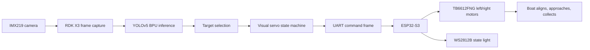

# RDK X3 AI 自动驾驶水面垃圾收集船

本仓库是面向 2026 全国大学生嵌入式芯片与系统设计竞赛企业赛题的完整开源工程。项目以 RDK X3 为上层智能计算平台，结合 IMX219 摄像头、YOLOv5 目标检测、视觉伺服状态机、ESP32-S3 下位机控制、TB6612FNG 双推进电机和 WS2812B 状态灯，构成一艘面向校园人工湖、景观水池和实验水池的小型 AI 自动驾驶水面垃圾收集船。

项目目标不是只展示识别框，而是形成从视觉感知、目标锁定、船体对准、自动接近到导流收集的闭环演示。

## Features

- RDK X3 端 FastAPI 服务，提供实时大屏、MJPEG 视频流、状态 JSON 和急停接口。
- D-Robotics RDK X3 Bernoulli2 官方 YOLOv5 `.bin` 模型推理链路，默认使用 YOLOv5n，附 YOLOv5s 可选权重。
- 视觉伺服状态机：`SEARCH`、`LOCKED`、`ALIGN`、`APPROACH`、`COLLECT`、`RETRY`、`STOP`、`ERROR`。
- ESP32-S3 PlatformIO 固件，解析 RDK 串口命令并驱动 TB6612FNG 双电机与 WS2812B 灯带。
- 保留比赛展示 UI：`ui/Target-UI.html` 不改视觉结构，服务端运行时接入 `/stream.mjpg` 与 `/api/status`。
- 支持无硬件 demo/mock 模式，方便本地预览、CI 和评委快速理解系统闭环。

## Repository Layout

```text
.
├── config/                 # demo 与 RDK X3 上板配置
├── docs/                   # 部署、接线、模型和协议说明
├── firmware/esp32_s3/      # ESP32-S3 + TB6612FNG + WS2812B 固件
├── models/                 # RDK X3 YOLOv5 BPU 模型与校验文件
├── scripts/                # 模型下载与 RDK 模型加载检查
├── src/lakerboat/          # RDK X3 Python 后端和控制算法
├── tests/                  # Python 单元测试
└── ui/                     # 原始大屏 UI 与 Logo
```

## Quick Start: Demo Mode

```bash
python -m venv .venv
.venv\Scripts\activate
python -m pip install -e .[dev,vision]
lakerboat run --config config/demo.yaml
```

Open:

```text
http://127.0.0.1:8000
```

Demo mode uses a generated mock water target and mock serial output. It proves the dashboard, status schema, state machine and service contract without requiring RDK X3 or ESP32-S3.

## RDK X3 Deployment

On the RDK X3:

```bash
sudo apt update
sudo apt install -y python3-pip python3-opencv
python3 -m pip install -e .
bash scripts/download_models.sh
python3 scripts/rdk_model_smoke.py
lakerboat run --config config/rdk_x3.yaml
```

Then open `http://<rdk-ip>:8000` from a PC on the same network.

More details:

- [RDK X3 deployment](docs/deployment-rdk-x3.md)
- [Hardware wiring](docs/hardware-wiring.md)
- [Serial and HTTP protocol](docs/protocol.md)
- [Model notes](docs/model.md)

## System Flow



## Runtime Interfaces

- `GET /` - left-side monitoring dashboard.
- `GET /stream.mjpg` - MJPEG annotated camera stream.
- `GET /api/status` - JSON status consumed by the UI.
- `GET /api/health` - service health check.
- `POST /api/control/stop` - emergency stop.

The serial command sent from RDK X3 to ESP32-S3 is:

```text
<A,left,right,state,light,pump>\n
```

Example:

```text
<A,51,89,APPROACH,2,0>
```

## Validation

```bash
python -m pip install -e .[dev]
pytest
```

PlatformIO firmware build:

```bash
cd firmware/esp32_s3
pio run
```

## License

Apache License 2.0. See [LICENSE](LICENSE) and [NOTICE](NOTICE).
