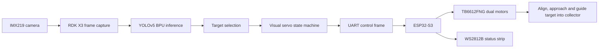

# RDK X3 AI Autonomous Surface Waste Collection Boat

[](https://github.com/Wallaby-Wang/rdk-x3-ai-waste-collector-boat/actions/workflows/ci.yml)

English | [中文说明](README_cn.md)

This repository contains the complete open-source engineering implementation for an RDK X3 based AI autonomous surface waste collection boat. The project is built for an embedded chip and system design competition task and follows the system described in the project report: RDK X3 performs camera capture, local YOLO inference and high-level navigation decisions, while ESP32-S3 handles UART command parsing, PWM motor control and WS2812B status feedback.

The goal is not only to show object detection boxes. The system closes the loop from visual perception to target locking, differential steering, low-speed approach and guided collection through the middle intake channel of the boat.

## Project Highlights

- RDK X3 FastAPI runtime with dashboard, MJPEG stream, JSON status endpoint and emergency stop API.
- D-Robotics RDK X3 Bernoulli2 YOLOv5 model path, with official YOLOv5n and YOLOv5s `.bin` model assets and SHA256 checksums.
- Visual servo state machine for `SEARCH`, `LOCKED`, `ALIGN`, `APPROACH`, `COLLECT`, `RETRY`, `STOP` and `ERROR`.
- ESP32-S3 PlatformIO firmware for TB6612FNG dual motor drive and WS2812B status light control.
- UART protocol compatible with simple debugging commands and structured motor-control frames.
- Demo/mock mode so the dashboard and control loop can run without hardware.
- Open-source project structure with deployment documentation, wiring notes, model notes, protocol documentation, tests, CI, license and contribution guidance.

## System Architecture



## Repository Layout

```text
.
├── config/                 # Demo and RDK X3 runtime configuration
├── docs/                   # Deployment, wiring, model and protocol docs
├── firmware/esp32_s3/      # ESP32-S3 motor and status-light firmware
├── models/                 # RDK X3 YOLOv5 BPU models and checksums
├── scripts/                # Model download and RDK model smoke checks
├── src/lakerboat/          # RDK X3 Python runtime and control logic
├── tests/                  # Python tests
└── ui/                     # Competition dashboard UI and logo
```

## Report Alignment

The implementation is intentionally mapped to the project report.

| Report requirement | Repository implementation |
| --- | --- |
| RDK X3 as upper controller | `src/lakerboat` runtime, camera, detector, state machine and web service |
| IMX219 / front camera input | `camera.py`, `config/rdk_x3.yaml`, `/stream.mjpg` |
| YOLO-based target detection | `detection.py`, `models/*.bin`, `docs/model.md` |
| Vision-guided differential navigation | `control.py`, visual servo state machine |
| ESP32-S3 lower controller | `firmware/esp32_s3` PlatformIO project |
| TB6612FNG dual motor drive | `board_config.h`, `main.cpp`, wiring docs |
| UART command protocol | `serial_link.py`, `protocol.h`, `docs/protocol.md` |
| 10-12 Hz control refresh and fail-safe stop | `serial.control_hz: 12`, RDK command throttling, ESP32-S3 900 ms watchdog |
| WS2812B green/blue/red status display | ESP32 firmware and `docs/hardware-wiring.md` |
| Water pump as assisted collection load | `PIN_PUMP` reserved in firmware, explained in wiring docs |
| Complete source and deployment notes | README, `docs/`, tests, CI, license and contribution files |

## Quick Start: Demo Mode

Demo mode uses generated frames and mock serial output. It is useful for local review, CI and demonstrating the full software loop without RDK X3 hardware.

```bash
python -m venv .venv
.venv\Scripts\activate
python -m pip install -e .[dev,vision]
lakerboat run --config config/demo.yaml
```

Open:

```text
http://127.0.0.1:8000
```

## RDK X3 Deployment

On the RDK X3:

```bash
sudo apt update
sudo apt install -y git python3-pip python3-opencv
python3 -m pip install --upgrade pip
python3 -m pip install -e .
bash scripts/download_models.sh
python3 scripts/rdk_model_smoke.py
lakerboat run --config config/rdk_x3.yaml
```

Open from a PC on the same network:

```text
http://<rdk-ip>:8000
```

Detailed documents:

- [RDK X3 deployment](docs/deployment-rdk-x3.md)
- [Hardware wiring](docs/hardware-wiring.md)
- [Serial and HTTP protocol](docs/protocol.md)
- [Model notes](docs/model.md)
- [Software architecture](docs/architecture.md)

## Runtime Interfaces

- `GET /` - competition dashboard.
- `GET /stream.mjpg` - annotated MJPEG video stream.
- `GET /api/status` - JSON status consumed by the dashboard.
- `GET /api/health` - service health check.
- `POST /api/control/stop` - emergency stop.

The RDK X3 to ESP32-S3 control frame is:

```text
<A,left,right,state,light,pump>\n
```

Example:

```text
<A,51,89,APPROACH,2,0>
```

The default UART baud rate is 115200 bps. The RDK runtime sends motor frames at up to 12 Hz, while `STOP` and `ERROR` states are transmitted immediately. The ESP32-S3 firmware stops both motors if no valid command is received for about 900 ms.

The firmware also supports debug commands:

```text
SEARCH
LEFT
RIGHT
FORWARD
COLLECT
STOP
```

## Validation

Python tests:

```bash
python -m pip install -e .[dev]
pytest
```

Firmware build:

```bash
cd firmware/esp32_s3
pio run
```

The GitHub Actions workflow runs both Python tests and ESP32-S3 firmware compilation.

## Open-Source Notes

- The repository contains source code, firmware, configuration, model download scripts, deployment instructions and CI.
- Raw project report documents and competition PDFs are intentionally not included in the repository.
- The included RDK X3 YOLOv5 `.bin` model files are official D-Robotics public model assets, with checksums recorded in `models/SHA256SUMS`.

## License

Apache License 2.0. See [LICENSE](LICENSE) and [NOTICE](NOTICE).
