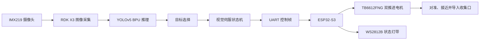

# 基于 RDK X3 的 AI 自动驾驶水面垃圾收集船

[](https://github.com/Wallaby-Wang/rdk-x3-ai-waste-collector-boat/actions/workflows/ci.yml)

[English](README.md) | 中文说明

本仓库是面向嵌入式芯片与系统设计竞赛企业赛题的完整开源工程实现。项目以 RDK X3 为上层智能计算平台，结合 IMX219 摄像头、YOLOv5 目标检测、视觉引导状态机、ESP32-S3 下位机、TB6612FNG 双路电机驱动和 WS2812B 状态灯带，实现一艘面向校园人工湖、景观水池、公园小型水域和实验水池的 AI 自动驾驶水面垃圾收集船。

本项目的重点不是单纯显示目标检测框，而是把识别结果转化为真实运动控制，形成“视觉感知、目标锁定、船体对准、低速接近、导流收集”的完整闭环。

## 项目特点

- RDK X3 端 FastAPI 服务，提供展示大屏、MJPEG 视频流、状态 JSON 和急停接口。
- 使用 D-Robotics RDK X3 Bernoulli2 官方 YOLOv5 `.bin` 模型，仓库包含 YOLOv5n 和 YOLOv5s 权重及 SHA256 校验。
- 视觉伺服状态机覆盖 `SEARCH`、`LOCKED`、`ALIGN`、`APPROACH`、`COLLECT`、`RETRY`、`STOP`、`ERROR`。
- ESP32-S3 PlatformIO 固件负责 UART 命令解析、TB6612FNG 双电机 PWM 控制和 WS2812B 状态灯控制。
- 串口协议同时兼容调试短命令和正式结构化控制帧。
- 支持 demo/mock 模式，无硬件时也能运行大屏、状态机和接口。
- 提供源码、固件、模型、部署文档、接线说明、协议说明、测试、CI、许可证和贡献规范。

## 系统架构



## 仓库结构

```text
.
├── config/                 # demo 与 RDK X3 上板配置
├── docs/                   # 部署、接线、模型和协议说明
├── firmware/esp32_s3/      # ESP32-S3 电机与状态灯固件
├── models/                 # RDK X3 YOLOv5 BPU 模型与校验文件
├── scripts/                # 模型下载与 RDK 模型加载检查脚本
├── src/lakerboat/          # RDK X3 Python 后端和控制算法
├── tests/                  # Python 单元测试
└── ui/                     # 竞赛展示大屏 UI 与 Logo
```

## 与作品报告的对应关系

仓库实现已按 `作品报告.docx` 的系统设计逐项落地：

| 报告内容 | 仓库实现 |
| --- | --- |
| RDK X3 作为上位机 | `src/lakerboat` 中的采集、推理、状态机和 Web 服务 |
| IMX219 / 前视摄像头输入 | `camera.py`、`config/rdk_x3.yaml`、`/stream.mjpg` |
| YOLO 识别典型漂浮目标 | `detection.py`、`models/*.bin`、`docs/model.md` |
| 根据目标中心偏差和面积进行视觉引导 | `control.py` 视觉伺服状态机 |
| ESP32-S3 作为下位机 | `firmware/esp32_s3` PlatformIO 固件 |
| TB6612FNG 双电机差速控制 | `board_config.h`、`main.cpp`、硬件接线文档 |
| RDK X3 与 ESP32-S3 UART 通信 | `serial_link.py`、`protocol.h`、`docs/protocol.md` |
| 10-12 Hz 控制刷新与失联安全停车 | `serial.control_hz: 12`、RDK 指令限频、ESP32-S3 900 ms 看门狗停车 |
| WS2812B 绿/蓝/红状态反馈 | ESP32 固件与 `docs/hardware-wiring.md` |
| 水泵辅助导流收集 | 固件预留 `PIN_PUMP`，接线文档说明默认独立供电与可扩展控制 |
| 完整源码与部署说明 | README、`docs/`、测试、CI、许可证和贡献说明 |

## 快速启动：Demo 模式

Demo 模式使用生成画面和模拟串口输出，适合本地预览、评审快速查看和 CI 验证。

```bash
python -m venv .venv
.venv\Scripts\activate
python -m pip install -e .[dev,vision]
lakerboat run --config config/demo.yaml
```

浏览器打开：

```text
http://127.0.0.1:8000
```

## RDK X3 上板部署

在 RDK X3 上执行：

```bash
sudo apt update
sudo apt install -y git python3-pip python3-opencv
python3 -m pip install --upgrade pip
python3 -m pip install -e .
bash scripts/download_models.sh
python3 scripts/rdk_model_smoke.py
lakerboat run --config config/rdk_x3.yaml
```

同一局域网电脑访问：

```text
http://<rdk-ip>:8000
```

详细文档：

- [RDK X3 部署说明](docs/deployment-rdk-x3.md)
- [硬件接线说明](docs/hardware-wiring.md)
- [串口与 HTTP 协议](docs/protocol.md)
- [模型说明](docs/model.md)
- [软件架构](docs/architecture.md)

## 运行接口

- `GET /` - 竞赛展示大屏。
- `GET /stream.mjpg` - 带检测框的视频流。
- `GET /api/status` - 展示大屏轮询的状态 JSON。
- `GET /api/health` - 服务健康检查。
- `POST /api/control/stop` - 急停接口。

RDK X3 发送给 ESP32-S3 的正式控制帧：

```text
<A,left,right,state,light,pump>\n
```

示例：

```text
<A,51,89,APPROACH,2,0>
```

默认 UART 波特率为 115200 bps。RDK 运行时按最高 12 Hz 下发电机控制帧，`STOP` 和 `ERROR` 会立即下发；ESP32-S3 固件在约 900 ms 未收到有效命令时自动停止左右电机。

固件也兼容调试短命令：

```text
SEARCH
LEFT
RIGHT
FORWARD
COLLECT
STOP
```

## 验证方式

Python 测试：

```bash
python -m pip install -e .[dev]
pytest
```

ESP32-S3 固件编译：

```bash
cd firmware/esp32_s3
pio run
```

GitHub Actions 会自动运行 Python 测试和 ESP32-S3 固件编译。

## 开源说明

- 仓库包含完整源码、固件、配置、模型下载脚本、部署说明和 CI。
- 原始作品报告 DOCX 和竞赛通知 PDF 不放入公开仓库，避免公开冗余材料和潜在个人信息。
- 仓库中的 RDK X3 YOLOv5 `.bin` 模型来自 D-Robotics 官方公开模型资源，校验值记录在 `models/SHA256SUMS`。

## License

Apache License 2.0. See [LICENSE](LICENSE) and [NOTICE](NOTICE).
